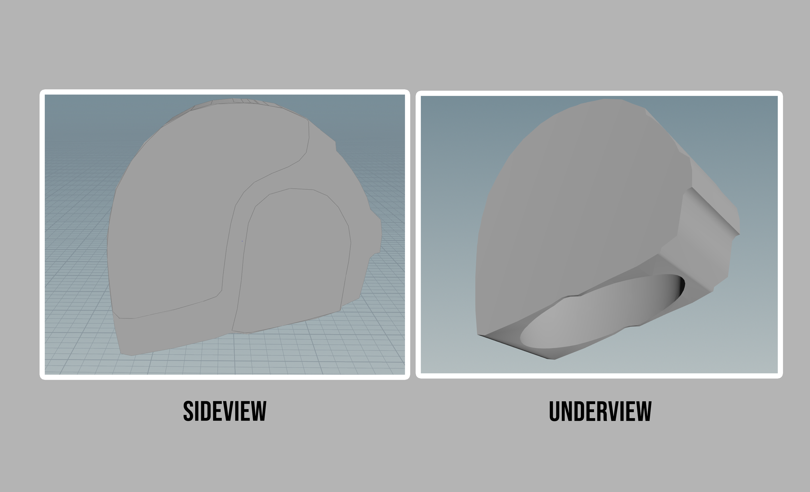
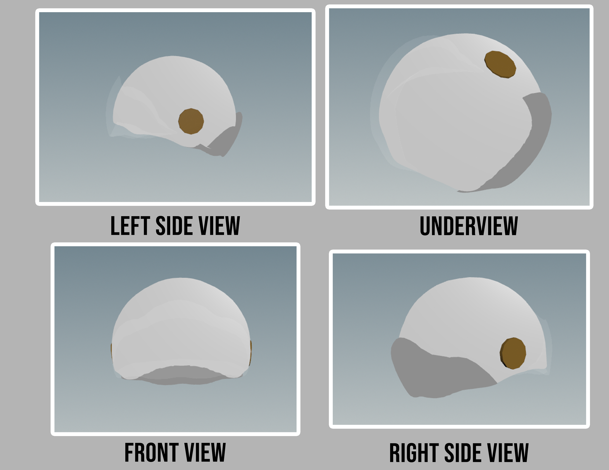
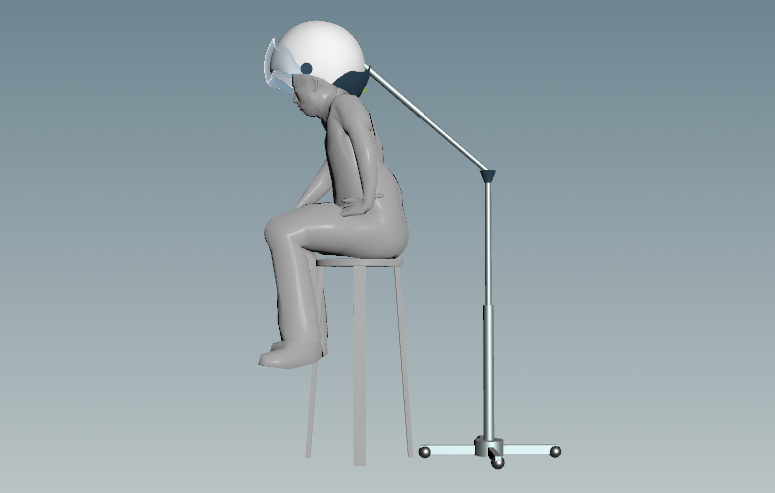
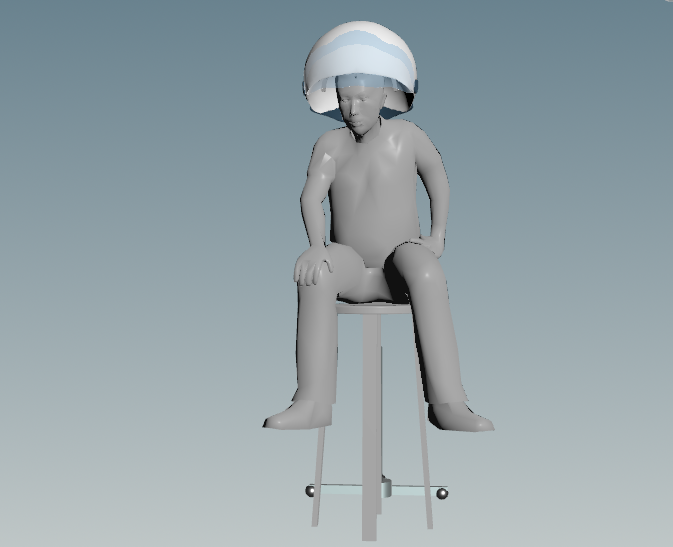
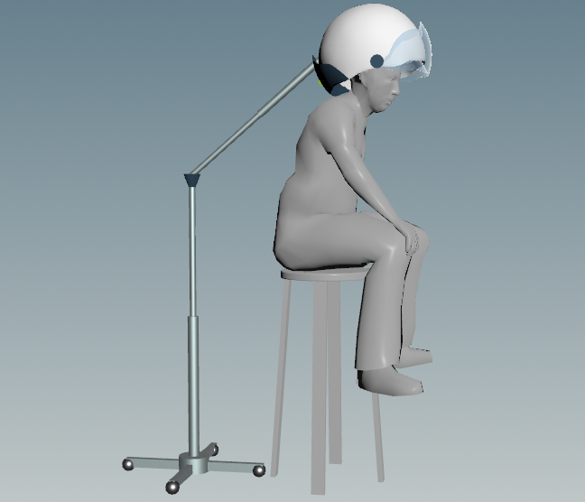
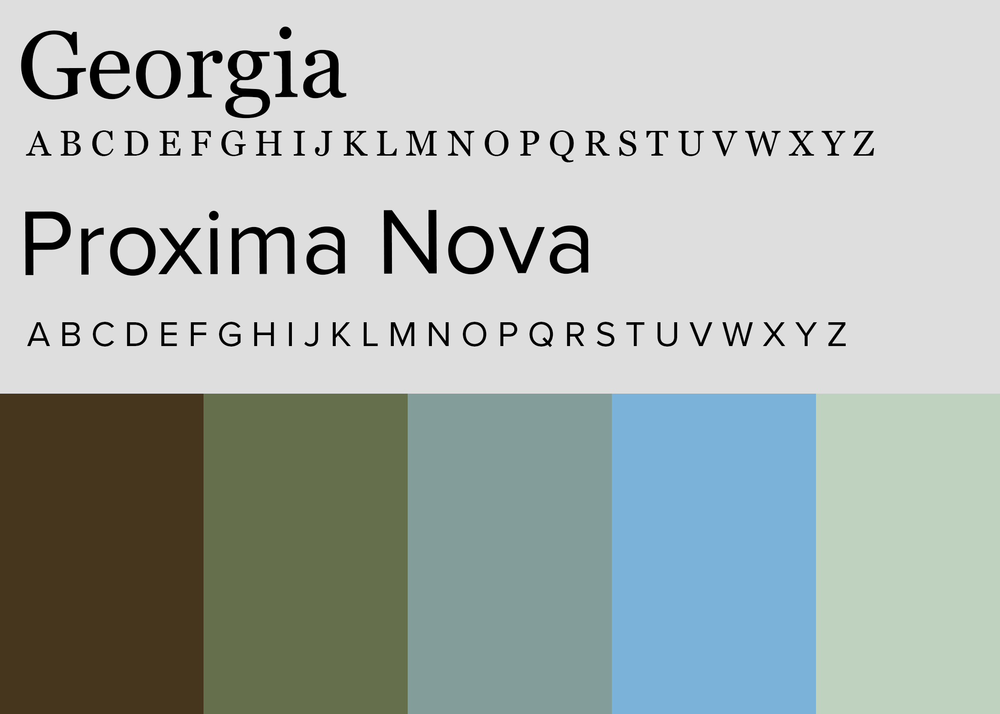
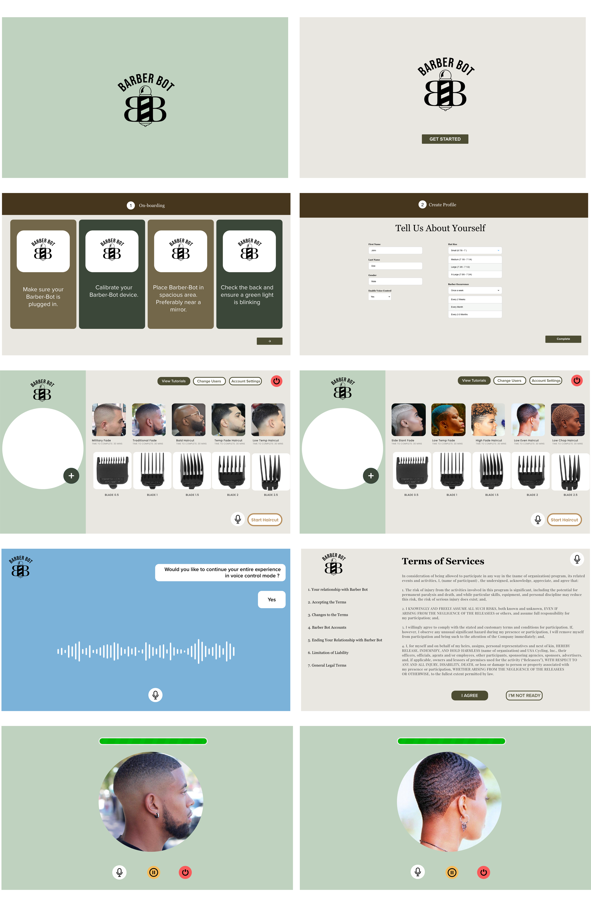
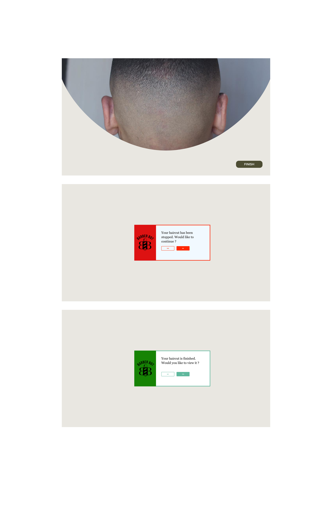

<small>[Back To README](https://github.com/maubanel/Barber-Bot) </small>

## Model Iterations
Phase 1: Here is a first pass of what Barber-Bot is shaping to look like. I decided to 3-D model Barber-Bot in Houdini. I was mainly inspired from a helmet and below are some screenshots of what I created so far. Later iterations are currently in progress.

Phase 2 : Here is a second pass of what Barber-Bot is shaping to look like. I am continuing to 3-D model Barber-Bot in Houdini. I have spherical shape with clear glass visor on the front to display the UI screen.

Phase 3 : Here is my third pass of what Barber-Bot is shaping to look like. I have fleshed out the model and color choices. The main helmet is attached is a base with wheels so the device has mobility. 

## Color Palette

Here is the color palette that will be used in the UI system which will be seen in the clear glass view of the helmet.

## Visual Designs (First Round)
Below I have my updated Barber-Bot UI designs with the chosen color pallet. I wanted to find a balance in colors because I didnt want the designs to be too masculine because I want this prodcut to be used by anyone.

