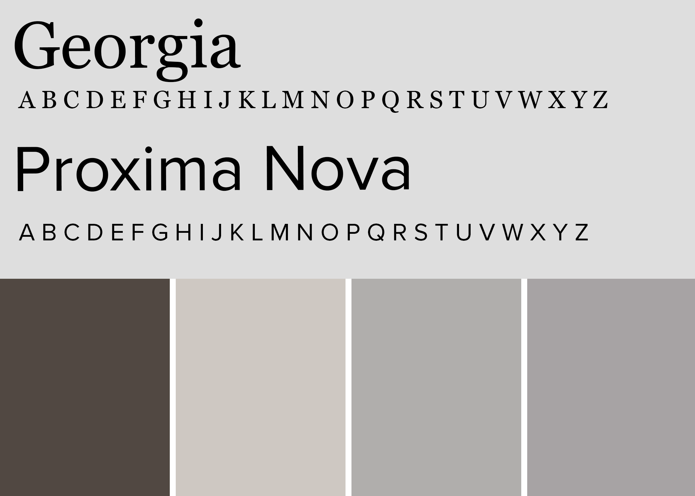

<small>[Back To README](https://github.com/maubanel/Barber-Bot) </small>

## Pre-Model Ideas
Here is a first pass of what Barber-Bot is shaping to look like. I decided to 3-D model Barber-Bot in Houdini. I was mainly inspired from a helmet and below are some screenshots of what I created so far. Later iterations are currently in progress.

## Color Palette

