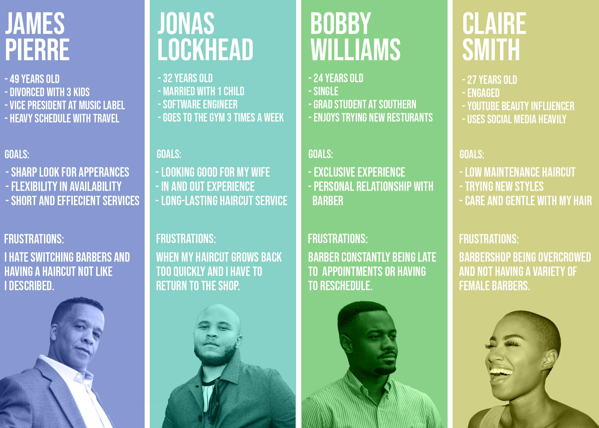

<small>[Back To README](https://github.com/maubanel/Barber-Bot) </small>

## Brand
The Barber-Bot is a luxury futuristic self-haircutting product for those indivduals looking for a barbership experience at home.

## Culture
Portable and Luxurious

## Reputation  
Barber-Bot will have a reputation of reliability and offering convenience. Providing consistent quality haircuts all while being safe in your home or setting of choice.

## Industry
[Personal Care Services](https://datausa.io/profile/soc/barbers#about)

- TOTAL WORKFORCE - 80k
- AVERAGE AGE - 39.9
- AVERAGE SALARY - $27,388
- AVERAGE MALE SALARY - $28,706
- AVERAGE FEMALE SALARY - $23,037

## Competitors

-	[Remington HC4250](https://www.remingtonproducts.com/products/mens/clippers-and-trimmers/hair-clippers/hc4250-shortcut-clipper-pro.aspx)
-	[Wahl Self-Cut Personal Haircutting Kit](https://wahlusa.com/products/self-cut-pro-79467.html)
-	[MANGROOMER Ultimate Pro Self-Haircut Kit](https://www.amazon.com/MANGROOMER-ULTIMATE-Self-Haircut-Clippers-Waterproof/dp/B0745SC21L/ref=asc_df_B0745SC21L/?tag=hyprod-20&linkCode=df0&hvadid=312139826288&hvpos=&hvnetw=g&hvrand=10675250888390838668&hvpone=&hvptwo=&hvqmt=&hvdev=c&hvdvcmdl=&hvlocint=&hvlocphy=9025387&hvtargid=pla-633310957357&psc=1)
- [The Barber Eliminator](https://www.hammacher.com/product/barber-eliminator)

How do we create a unique position that separates us?
Barber-Bot will be unique in the fact that it will be cross any gender bounderies. In addition, Barber-Bot will continue a traditional babrerhsop experience with a luxury twist.

## User Personas
Pre Assumptions of what users would be interested in using the Barber-Bot. Barber-Bot will be able to serve any community and style anyone looking for a low-hairucts and fades.

 

