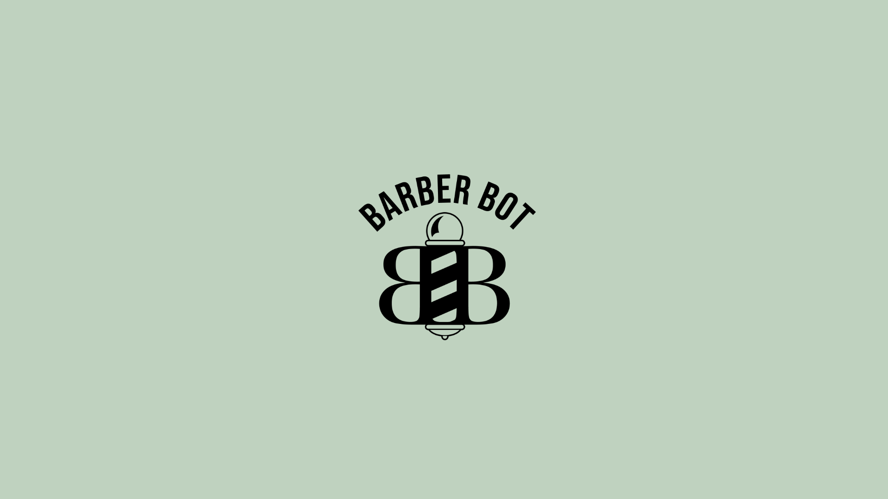

# Barber-Bot

# Executive Summary

Roderick Wilkins

Fall 2020 UX Product Design Project
Barber Bot

## PreScreen 
### [PreScreen](https://github.com/maubanel/Barber-Bot/blob/master/prescreen.md)

## Industry Research
### [Industry Research](https://github.com/maubanel/Barber-Bot/blob/master/IndustryResearch.md)

## Information Architecture
### [Information Architecture](https://github.com/maubanel/Barber-Bot/blob/master/InformationArchitecture.md)

## UX Research
### [UX Research](UXResearch.md)

## 3-D & Visual Design
### [3-D Visual Design](3dvisualdesign.md)

## UI Experience and Mockup 
### [Barber-Bot Tutorial Video](https://lsu.box.com/s/dxuid4if3rrg0w6i50anih0spqv9csft)
### [Barber-Bot Voice Command Experience Video](https://lsu.box.com/s/fiyxcsd92hlnrgrdeg2cfovxq9hxq48q)

