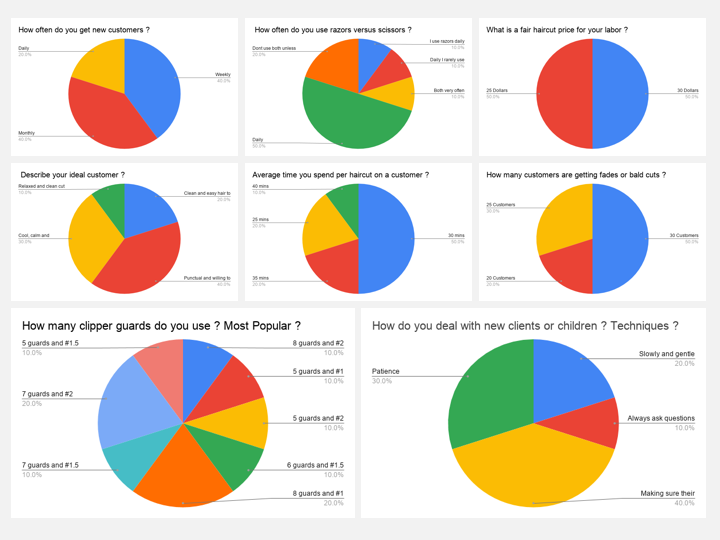
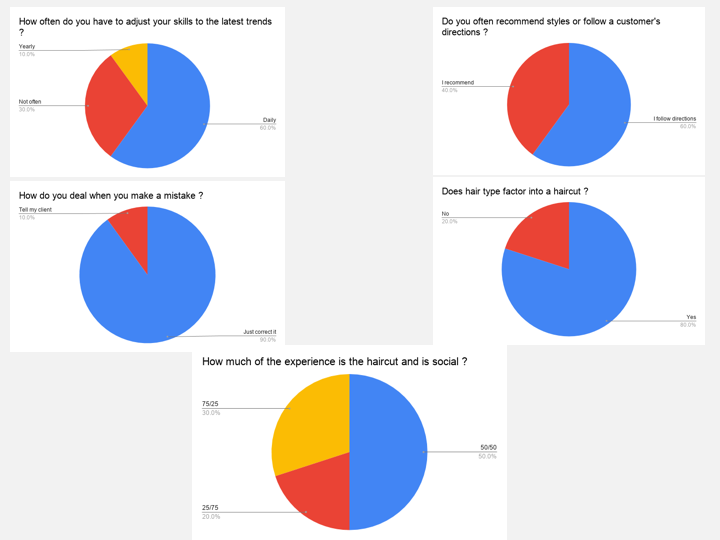
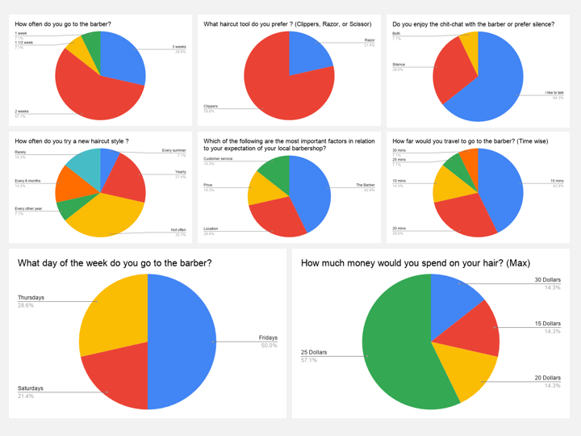
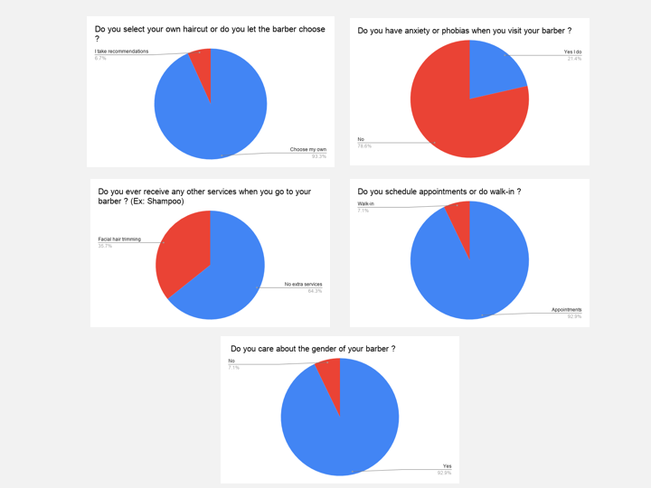
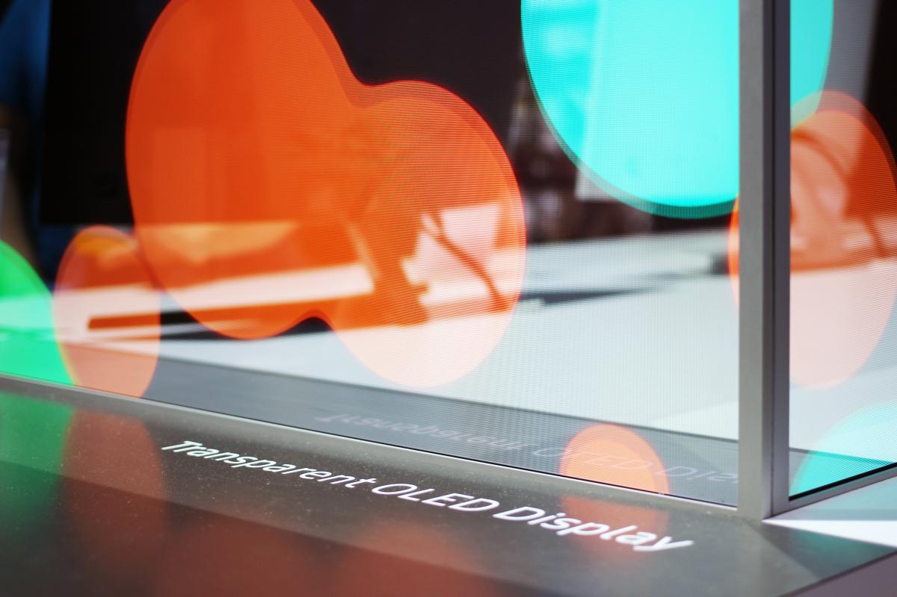
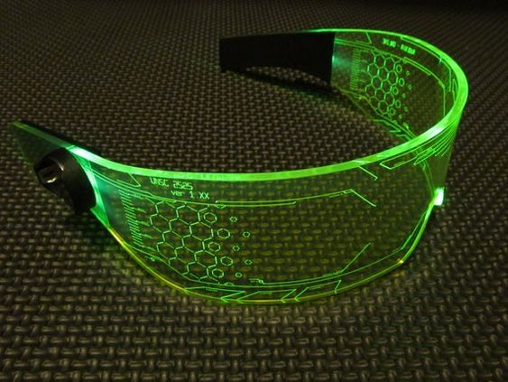
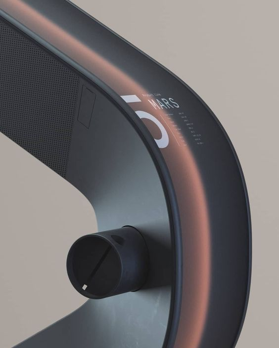
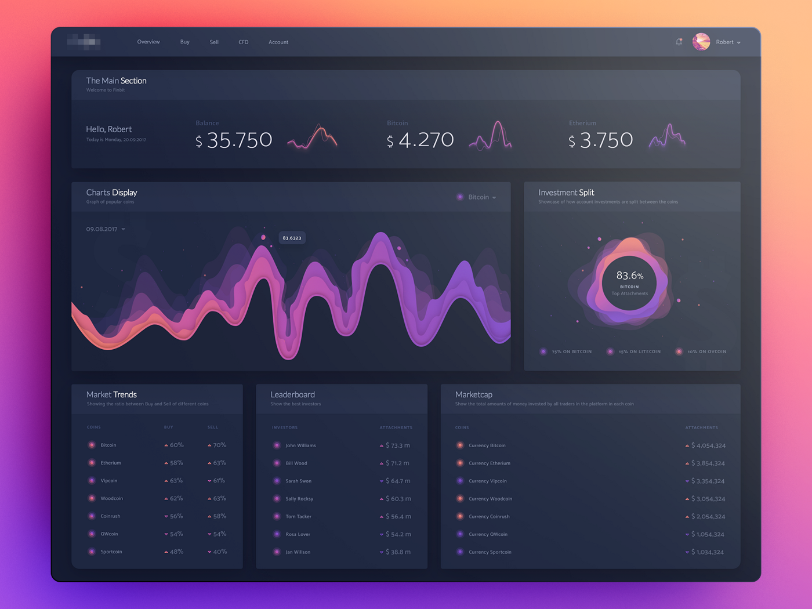

# UX Research
I surveyed multiple barbers in the local Baton Rouge area and customers who get haircuts. 

## User Interviews (For Barbers)
Questions 
- How often do you get new customers ?
- How often do you use razors versus scissors ?
- Average time you spend per haircut on a customer ?
- How many clipper guards do you use ? Most popular ?
- Describe your ideal customer ?
- What is a fair haircut price for your labor ?
- How do deal with new clients or children ? Techniques ?
- How many customers are getting fades or bald cuts ?
- How often do you have to adjust your skills to the latest trends ?
- Do you often recommend styles or follow a customer's directions ?
- How do you deal when you make a mistake ?
- Does hair type factor into a haircut ?
- How much of the experience is the haircut and is social ?

## User Interviews (For Customers)
Questions 
- How often do you go to the barbershop ?
- Do you select your own haircut or  do you let your barber decide ?
- How far would you travel to go to a barber ?
- Do you enjoy the chit-chat with the barber or prefer silence ?
- What day of the week do you prefer to get a haircut on ?
- What haircut tool do you prefer ? Razor or Scissors
- What is your limit you would spend on a haircut ?
- How often do you try a new haircut style ?
- In order of importance which of the following are the most important factors in relation to your expectation of your local barbershop ? (Atmopshere, The Barber, Location, Price or Customer Service)
- Do you ever recieve any other services when you go to your barber ? Ex: Shampooing
- Do you have any anxiety or phobias when you visit your babrer ?
- Do you schedule appointments or do you walk-in ?
- Do you care about the gender of your barber ?

## Analysis
Some of the keys learnings I gathered from the research is how grooming is a vital part of human life. From the barbers persepctive I learned that technique and consistency is the key to obtaining and retaining customers. Technique because its your skills that measures your talent and consistency that ensures you perform it everytime. Additionally, from the data I learned the average haircut is about 30 mins and most barbers are adjusting thei skills to keep up with trends. Also, hair type does matter and can impact the length of the haircut and most barbers like to socialize with their client during the haircut, it helps build a relationship. To my surprise from the data most customers enjoy the socializing as well. From the data I learned most people go to the barbershop every 2 weeks and prefer to travel short distancing for a haircut. I learned trying a new haircut isnt always a thing but does happen occasionaly. This research helped guide my UI in the right direction.

## Voice Control
Barber-Bot will have the ability for you have your experience done in voice command. In addition, to be having a touch UI screen the voice commands will help provide a more traditional barbershop experience. The voice command will listen and perform the task being spoken. Voice command also help with accessibility in allowing visually inpaired users to use Barber-Bot.

## Transparent OLED Display

[Video of Transparent Display in Action](https://www.youtube.com/watch?time_continue=111&v=_lT-YdomsIE&feature=emb_logo)

## Implement Display into Helmet Seamlessly

## Deep Flat Colors

