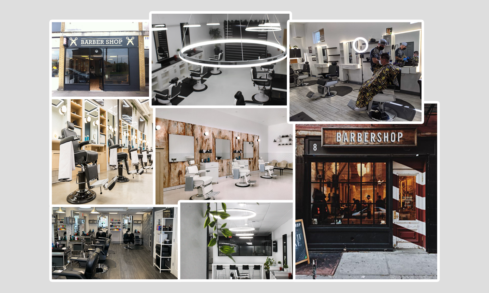
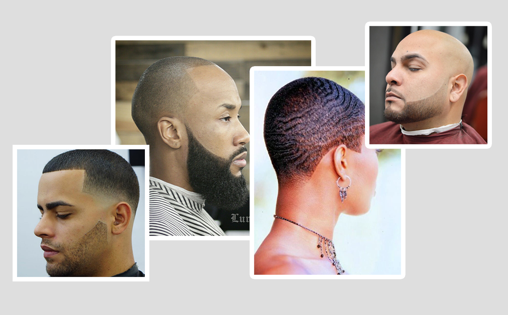
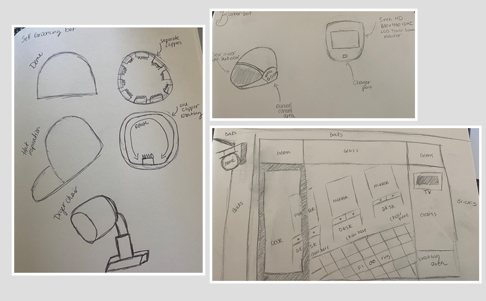

<small>[Back To README](https://github.com/maubanel/Barber-Bot) </small>

## Region
The Barber-Bot would be popular and more recieved on the west-coast. On the west-coast there is a culture of progressive technology with AI technology, so the Barber-Bot would fit in perfectly. More customers would be willing to try the product at home and also barbershops would be willing to try have the product in the shop to help reduce wait times.

## Main Target Audience

The main target audience for this product are:
- Men/Women who don't care for barbershop talk and just want a quick haircut (Bald/Fade cuts)
- Men/Women who would like a more luxury experience than the traditional haircut.
- Men/Women who have fast pace lifestlyes and this product will more convient.

## Demographics

- Gender: No specific gender
- Education: High School or higher
- Occupations: White collar professionals, 
- Age: 20s - 40s
- Income: 60,000 or higher 

## Traits & Lifestyles

- Traits: Technophile, Confident, Goal-oriented, Calculated
- Lifestyles: Risk-taker, Fast-paced, Convenience

## Mood Board

I created a collage of various barbershop layouts, styles, and store fronts. I wanted to set the tone and place of where Barber Bot could live and function in addition to being a at-home device. Within my collage you will notice I incoporated a lot of white and black with some wood tones. I love the idea of the barbershop having a modern feel and mimicing an luxury experience.

<kbd>
   
 </kbd>

## Bot Inspiration and Pre-Sketches

I am drawing my bot inspiration from a helmet and hair dryer. When I visualzie the product I see someone being able to be comfortably sit up under some spherical dome and the clipper being able to rotate and complete the desired haircut. My intial sketches are below of what I want Barber-Bot to look like. I also sketched a barbershop layout as well to show how barber-bot could exist in addition to being a at-home device. This product will only complete certain types of haircuts such bald, fade, and low cuts. The Barber-Bot will be super effective in these current COVID-19 circumstances.

<kbd>
   
 </kbd>

<kbd>
   
 </kbd>
